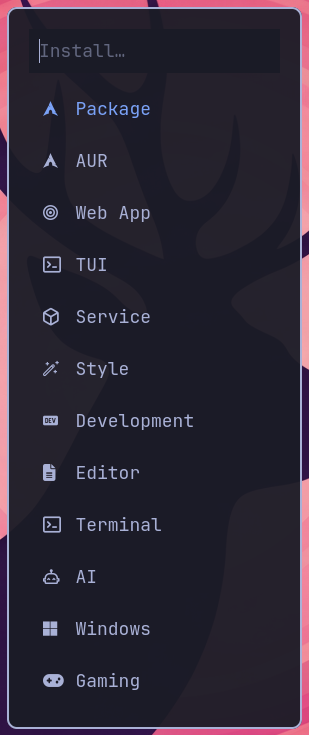
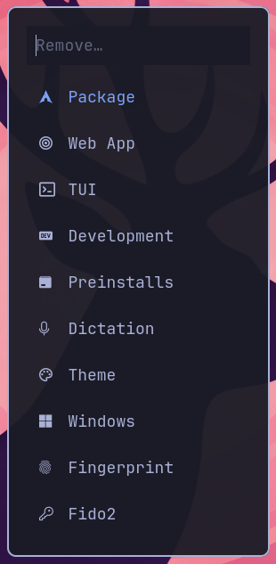

<div align="center">
  <h1>ZPWA</h1>
  <p><em>A Zen Browser PWA/SSB Suite for Omarchy</em></p>

  <font color="#A2D471">
    <pre>
 ▄███████▄     ▄███████▄  ▄█     █▄     ▄████████ 
██▀     ▄██   ███    ███ ███     ███   ███    ███ 
      ▄███▀   ███    ███ ███     ███   ███    ███ 
 ▀█▀▄███▀▄▄   ███    ███ ███     ███   ███    ███ 
  ▄███▀   ▀ ▀█████████▀  ███     ███ ▀███████████ 
▄███▀         ███        ███     ███   ███    ███ 
███▄     ▄█   ███        ███ ▄█▄ ███   ███    ███ 
 ▀████████▀  ▄████▀       ▀███▀███▀    ███    █▀  
    </pre>
  </font>
</div>

**ZPWA** is a high-performance CLI and TUI utility designed to transform the Zen Browser into a native-feeling PWA (Progressive Web App) engine, seamlessly injecting web applications into your [Omarchy](https://omarchy.org) managed Hyprland / Walker environment and system menus.

## Features
* **Zero-Config Injection:** Automatically adds PWAs to your Omarchy/Walker menus.
* **Isolated Profiles:** Each PWA runs in its own clean Zen Browser profile.
* **Native Hyprland Integration:** Custom window rule assignment support.
* **Atomic Updates:** Sync system-wide template changes to all local PWAs with one command.

<p align="center">
  
</p>

## Why ZPWA?

Browser extensions often demand excessive permissions, inject heavy background scripts, and lack the "OS-native" feel required for a professional workflow. ZPWA is built on a philosophy of **Zero-Trust, Deep Integration and Low Resource Impact**:

* **Security:** No data collection. No third-party extension APIs. Your PWAs are simple, isolated Gecko instances.
* **Performance:** Bypasses extension overhead, utilizing a proprietary socket calling daemon to catch keybinds with near-zero latency.
* **Aesthetic Unity:** Designed to look and feel like a native Omarchy system component. From the Walker menu integration to the Hyprland workspace rules, it disappears into your workflow.

See [PRODUCT.md](docs/PRODUCT.md) for more information.

## Quick Start

**Install via AUR**

```bash
# Using yay as an example, substitute yay for the AUR Helper of your choice.
yay -S zpwa
zpwa setup
```

> **Note:** ZPWA is built for [Omarchy](https://omarchy.org). As ZPWA is heavily integrated into and dependent on the default opinionated Omarchy setup, this software is not rated for use in other flavors of Arch, nor other Linux Distros.

**Run**
```bash
zpwa install                 # Create New Zen PWA
zpwa rm [--all]              # Remove PWAs
zpwa ls                      # List PWAs
zpwa update                  # Sync binds/templates

# Maintenance
zpwa setup                   # Re-run environment initialization
zpwa revert                  # Restore original system state
zpwa menu-change             # Change menu integration style
zpwa restore                 # [menu|binds] Select and restore snapshots
zpwa monitor                 # Run PWA monitor verbosely
zpwa -h, --help              # Show this menu
```
## Safety Design
<a name="safety"></a>
ZPWA is a local system integration tool, commands can perform destructive local operations.

This software uses safety-first defaults: path validation, intended modifiable-directory integration that respects the intended Omarchy customization hierarchy, backup-centric command flow, and explicit confi>

Review [SAFETY.md](docs/SAFETY.md) and [CLEANUP.md](docs/CLEANUP.md) for further detail on precautions taken, and manual cleanup instructions respectively.

## TUI & Menu

<div align="center">

#### Installing
<video src="https://github.com/user-attachments/assets/7ecb6095-3fd7-4f5b-a59a-d07711aa0b76" autoplay loop muted playsinline style="max-width: 100%; border-radius: 8px;"></video>

#### Uninstalling
<video src="https://github.com/user-attachments/assets/4592ebbb-c188-45e6-b8e4-abce3f9259b8" autoplay loop muted playsinline style="max-width: 100%; border-radius: 8px;"></video>

</div>

#### Omarchy/Walker Menu Integration
<p align="center">
  
  
</p>

<div align="center">
  <h2>Roadmap</h2>
</div>

```bash
# ZPWA Additions
* Keybind Passthrough Rewrite: A complete code base overhaul on how ZPWA handles system and user keybinds.
* Dynamic Keybind Support: Assign custom shortcuts per PWA.
* UWSM Bridging: Finalizing the 10% gap for perfect session management.
* Express vs. Custom WM: Choose between our optimized tiling/floating presets or append your own workspace rules and silent-launch flags.

# ZPWA to GPWA
A codebase rewrite to detect and support other Gecko-based browsers (Firefox/Librewolf)
while maintaining the Omarchy-native integration.

# Beyond Omarchy
Expanding support for other Wayland Compositors (Niri) and launchers beyond Walker.
```

**Scope Disclaimer:** While supporting more systems is an exciting prospect, the "magic" of ZPWA comes from its deep connection to the Omarchy workflow. If you require a generic PWA tool for non-Omarchy systems, we recommend [PWAsForFirefox](https://pwasforfirefox.filips.si/). While we cannot attest to its resource footprint or data handling, it remains a robust alternative for those not requiring our specific "skeptical-by-design" architecture.

See [PRODUCT.md](docs/PRODUCT.md) for more information.

## Disclaimer & Liability

ZPWA is provided "as is" without warranty of any kind. By using this software, you acknowledge:
1. **System Modification:** Modifies Hyprland configurations and desktop entries.
2. **Beta Software:** This is a public release; always maintain backups of your `.config` directory.
3. **No Liability:** The developers are not responsible for broken configurations or data loss.

Use at your own risk. See [Safety Design](#safety) for more information.

## Dependencies

* **[Omarchy](https://omarchy.org/):** An opinionated, performance-tuned Arch Linux distribution.
* **[Zen Browser](https://zen-browser.app/):** A privacy-focused, highly customizable Gecko-based browser.
* **[Hyprland](https://hypr.land/):** A dynamic tiling Wayland compositor that doesn't sacrifice looks for usability.
* **[Walker](https://github.com/abenz1267/walker):** A high-speed, highly extensible Wayland application runner.

### Other Dependencies
[gum](https://github.com/charmbracelet/gum) | [jQ](https://jqlang.org/) | [sed](https://www.gnu.org/software/sed/) | [curl](https://curl.se/) | [grep](https://www.gnu.org/software/grep/) | [socat](http://www.dest-unreach.org/socat/)

## Contributing

**Pull Requests > Forks.** To keep the project unified and high-quality, please submit PRs for roadmap features or bug fixes. If you intend to fork for a different ecosystem, please contact the maintainer first. In the event this project is marked "Unmaintained," forks are encouraged.

## About
The Single Site Browser / Progressive Web App generator for Zen Browser users on an Omarchy system.

Developed on release [3.4.2](https://github.com/basecamp/omarchy/releases/tag/v3.4.2) of Omarchy.

Thank you to [Mole](https://github.com/tw93/Mole), whose [README.md](https://github.com/tw93/Mole/blob/b8f2a3fb0da4d5e0070db958e7b6cc48217bb1aa/README.md) I used as a basis for the structure of this page.

ZPWA is released under GPLe3.0-or-later. Free, open source, and clearly defined in [LICENSE.txt](docs/LICENSE.txt)
